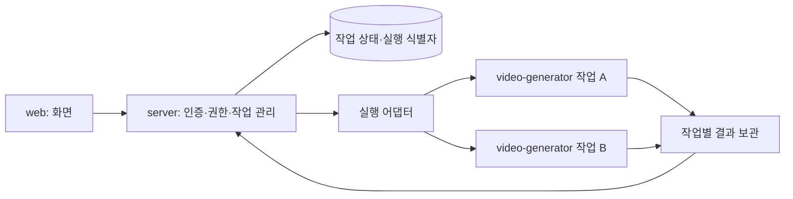

# ADR-0001: 세 레포와 작업별 영상 생성 컨테이너

- 상태: **사용자 승인 — 구현 전환은 별도 작업**
- 결정일: 2026-09-16
- 대상: `web`, `server`, `video-generator`의 책임, 배포, 실행 권한과 격리
- ADR(Architecture Decision Record): 선택한 설계와 그 이유, 감수한 단점을 기록하는 문서

## 1. 배경과 요구사항

서비스는 승인된 사용자의 시나리오를 받아 ChatGPT 구독으로 인증한 `codex exec`를 실행하고 영상을 만든다. Codex는 명령을 실행할 수 있다. 따라서 정상 사용자 또는 유출된 API 키로 들어온 악성 시나리오도 고려해야 한다.

현재는 미니 PC에서 운영하며, 이 장비는 사용자 PC와 연결되어 있다. 향후 클라우드로 이전한다. 유지보수와 배포의 단순함을 중요하게 여기며, 모든 가상 공격을 막기 위한 자체 보안 플랫폼을 만들지는 않는다.

확정된 요구사항은 다음과 같다.

- 레포와 애플리케이션 배포 단위는 `web`, `server`, `video-generator` 세 개로 유지한다.
- 각 단위는 Docker 이미지로 빌드하고 독립적으로 배포할 수 있어야 한다.
- server 배포 중 API 중단은 허용한다. 이미 실행 중인 영상 생성은 계속되고, 복구 후 조회·다운로드할 수 있어야 한다.
- video-generator 배포는 기존 작업을 유지하면서 새 작업도 접수·실행할 수 있어야 한다.
- 동시 실행은 구·신 버전을 합쳐 최대 5개로 제한한다.
- 처음에는 시나리오 텍스트만 받는다. 업로드와 미완성 제작 하네스의 포팅은 이번 결정 범위가 아니다.
- 인증은 사용자별 API 키, 생성기 인증은 Codex 구독 로그인이다. 유료 OpenAI API 키는 사용하지 않는다.
- 호스트에서 직접 사용하는 Codex 권한·설정은 변경하지 않는다. 미니 PC 전체의 Tailscale 차단 정책도 적용하지 않는다.
- 반복 배포는 비대화형으로 수행할 수 있어야 한다. 필요한 호스트 권한 설정은 초기 설치 단계로 분리한다.

## 2. 결정

**server가 작업을 관리하고, video-generator는 작업마다 새 컨테이너에서 실행한다. 컨테이너 생성 권한은 외부 API와 분리된 작은 실행 어댑터에 둔다.**

실행 어댑터는 server 레포의 인프라 구성으로 관리한다. 별도의 네 번째 제품 레포는 만들지 않는다. 다만 API와 같은 프로세스에 넣거나 API 컨테이너에 Docker 전체 권한을 주지 않는다.

레포 수와 실행 프로세스·이미지 수는 같을 필요가 없다. server 레포에 API, 작업 전달 기능, 미니 PC용 실행 어댑터 코드가 함께 있을 수 있지만, 각각의 권한과 수명은 분리한다.

그림은 논리적 흐름이다. runner가 상태 DB나 전체 결과 저장소에 직접 접근할 권한을 뜻하지 않는다. 미니 PC에서는 실행 어댑터가 결과를 회수·보관할 수 있고, 클라우드에서는 작업별로 제한된 업로드 권한을 사용할 수 있다.

### 단위별 책임

| 단위 | 책임 | 부여하지 않는 권한 |
|---|---|---|
| web | 시나리오 입력, 작업 상태와 결과 표시 | 컨테이너 생성, 운영 자격 증명 |
| server | 사용자 인증, 작업 소유권, 사용량 제한, 작업 접수·조회·다운로드, 실행 요청과 상태 복구 | 외부 API 프로세스의 Docker 전체 제어 |
| video-generator | 지정된 입력으로 Codex와 영상 제작 도구 실행, 결과 생성, 종료 | 사용자 인증 관리, Redis·API 키 접근, 다른 작업 접근, Docker 제어 |
| 실행 어댑터 | 승인된 실행 정의로 작업 시작·관찰·종료, 실행 식별자와 결과 회수 상태 보존 | 사용자 요청에 따른 임의 이미지·명령·마운트·권한 변경 |

**영상 생성 작업 하나에 컨테이너 하나**다. 상태 조회나 다운로드 요청에는 새 컨테이너를 만들지 않는다. 이미지는 배포 때 미리 빌드하고 작업마다 재사용한다.

## 3. 선택 이유와 대안의 트레이드오프

| 대안 | 장점 | 비용·위험 | 판단 |
|---|---|---|---|
| 공유 생성기 컨테이너 안에서 여러 작업 실행 | 초기 구현이 단순하고 도구·캐시 공유가 쉬움 | 같은 권한의 Codex가 다른 작업 파일·프로세스에 접근할 수 있음. 작업 종료 후 흔적 제거와 개별 자원 제한을 별도로 구현해야 함 | 가능하지만 이번에는 선택하지 않음 |
| 공유 생성기를 구·신 버전 두 개로 운영 | 기존 작업을 기다리는 방식으로 무중단 배포 가능 | 이전 버전의 작업 종료 대기, 신규 접수 차단, 버전 전체에 걸친 실행 한도 관리가 필요함. 작업 간 격리 문제는 별개로 남음 | 공유 컨테이너 선택 시 가능한 배포 방법 |
| 작업별 컨테이너, server가 작업 관리 | 생성기 코드를 입력→처리→종료로 단순화. 작업별 버전·자원·정리가 명확함 | 실행 요청, 상태 복구, 결과 회수, 컨테이너 정리 기능이 필요함. 초기화와 캐시 효율에 비용이 있음 | **선택** |
| video-generator에 별도 상주 관리자 구축 | 생성 기능이 작업 접수부터 실행까지 독립적으로 소유 | server와 작업 관리 책임이 중복되기 쉽고 상주 서비스가 늘어남 | 현재 규모에서는 불필요한 확장으로 판단 |
| 외부 API server에 Docker 소켓 직접 연결 | 실행 구현이 가장 짧아짐 | API 침해가 호스트 제어 권한으로 확대될 수 있음 | **선택하지 않음** |

### 유지보수 관점

작업별 컨테이너는 초기 코드가 가장 적은 선택은 아니다. 대신 작업 사이에 남는 파일·프로세스·환경 차이를 추적하는 비용을 줄인다. video-generator는 실행 플랫폼을 관리하지 않고 영상 제작에 집중한다.

실행 어댑터는 작은 고정 계약으로 제한한다. 범용 Docker API, 자체 스케줄링 플랫폼, 사용자 지정 실행 옵션을 만들지 않는다. 현재 단계에서 Kubernetes 같은 별도 운영 플랫폼의 도입도 전제하지 않는다.

### 배포 관점

작업의 수명을 API 프로세스나 배포 명령의 수명과 분리한다. 기존 작업은 기존 이미지로 끝내고 새 작업부터 새 이미지를 사용한다. 코드와 실행 환경이 작업 중간에 바뀌지 않아 원인 추적도 쉽다.

공유 컨테이너도 무중단 배포가 가능하므로, 무중단만을 이유로 작업별 컨테이너가 필수인 것은 아니다. 이번 선택은 **배포와 작업 간 격리를 함께 단순하게 설명하고 유지할 수 있다는 점**을 높게 평가했다.

### 현실적인 보안 관점

우선순위는 유출된 키, 다른 사용자 작업 접근, 작업 폭주, 악성 시나리오에 따른 명령 실행, 내부망 접근이다. 악성 시나리오가 Codex에 명령을 실행시키는 것은 커널 취약점을 이용하는 공격과 달리 서비스의 정상 기능을 악용하는 문제다.

작업별 컨테이너는 사용자 PC 보호의 유일한 방법은 아니다. 사용자 PC 보호에는 호스트·네트워크 접근 제한이 핵심이고, 작업별 컨테이너는 여기에 다른 작업으로의 피해 확산과 실행 흔적을 줄이는 경계를 추가한다.

## 4. 구현 시 지켜야 할 계약

### server → 실행 어댑터

- 공개 사용자는 server API만 호출한다. 실행 어댑터와 내부 작업 제어 인터페이스를 공개하지 않는다.
- 실행 요청은 작업 ID, 검증된 시나리오, 승인된 실행 정의 식별자처럼 제한된 필드만 받는다. 호출자가 이미지 주소, 셸 명령, 호스트 경로, 장치, 네트워크, 권한을 지정할 수 없어야 한다.
- 실행 정의 식별자는 배포자가 등록한 변경 불가능한 이미지 digest와 제한 설정에 대응한다. 공개 사용자가 버전이나 이미지를 선택하게 하지 않는다.
- 미니 PC에서는 접근 가능한 서비스가 제한된 UNIX 소켓을 사용할 수 있다. 클라우드에서는 서비스 신원 인증과 최소 권한을 사용한다. 내부 네트워크라는 이유만으로 호출자를 신뢰하지 않는다.
- API 키 원문, 사용자 키 저장소, Redis 자격 증명을 runner에 전달하지 않는다. 환경 변수는 필요한 항목만 명시적으로 구성한다.
- 같은 작업 ID와 같은 입력을 재요청하면 기존 실행에 연결한다. 같은 ID에 다른 입력이 오면 충돌로 거부한다. 재접속·재배포 때문에 중복 생성이나 중복 한도 차감이 일어나지 않도록 입력 해시와 실행 식별자를 보관한다.

### 상태와 결과

- 작업 소유권은 server가 관리한다. job ID를 아는 것만으로 조회·다운로드 권한을 얻지 못한다.
- server와 독립적인 실행 상태·결과 회수 경로가 있어야 한다. server가 내려가도 실행과 결과 저장이 가능해야 한다.
- 결과는 임시 작업 컨테이너 밖에 보존하고, 저장 완료를 확인한 뒤 완료 상태를 노출한다.
- runner에는 전체 저장소 권한을 주지 않는다. 반환 파일은 크기·형식·경로를 검증하고 심볼릭 링크와 경로 이동을 차단한다.
- server 복구 시 실행 식별자로 진행 상태·완료 결과를 다시 확인한다. 통신 연결이 끊겼다는 이유만으로 새 작업을 시작하거나 기존 작업을 종료하지 않는다.
- 작업 수·비용·동시 실행 한도는 지속적으로 보존한다. 구·신 버전이 각각 5개씩 실행하는 일이 없도록 전역 한도를 원자적으로 적용한다.

### runner의 실행 경계

- 비root, 최소 capability, no-new-privileges, 가능한 읽기 전용 rootfs, 작업별 임시 공간, CPU·메모리·PID·시간 제한을 유지한다.
- Docker 소켓, host network, 사용자 PC·호스트 파일·SSH 키를 노출하지 않는다. 초기에는 GPU 장치도 연결하지 않는다.
- 필요한 외부 API만 통신 가능하게 하고 사설망·tailnet·link-local·호스트 게이트웨이 접근을 차단한다.
- 종료·실패·시간 초과 때 해당 작업의 프로세스 전체와 임시 공간을 정리한다. 다른 작업을 함께 종료하지 않는다.
- Codex 로그인 정보는 작업에 필요한 범위로만 제공한다. 인증 갱신을 회수하더라도 임의 설정·실행 파일·작업 파일을 다음 작업에 복원하지 않는다.

## 5. 배포 수명

### server 배포

1. API 중단은 허용하되, 실행 중인 작업의 컨테이너와 실행 어댑터를 함께 종료하지 않는다.
2. 새 server가 기동하면 지속 저장한 실행 식별자로 기존 작업을 재확인한다.
3. server 중단 중 생성된 결과를 회수하여 원래 사용자에게 제공한다.

### video-generator 배포

1. 새 이미지를 빌드·검증하고 별도 digest로 등록한다.
2. 새 작업에 사용할 실행 정의를 전환한다. 기존 작업은 이전 정의를 유지한다.
3. 기존 작업을 처리하는 프로세스와 필요한 egress 연결·인증·결과 저장 경로를 유지한다.
4. 이전 실행 정의를 쓰는 작업이 모두 끝난 뒤 이전 자원을 정리한다. 롤백은 새 작업의 실행 정의를 이전 버전으로 돌리는 방식이며, 실행 중인 작업을 강제 변경하지 않는다.

이 무중단 요구는 우선 **생성기 이미지·하네스 배포**를 대상으로 한다. 실행 어댑터, 큐, 저장소, egress 프록시도 변경하는 배포에서는 각각의 연결 유지·호환성·교체 절차가 추가로 필요하다. 작업별 컨테이너만 도입했다고 이 계층의 무중단까지 자동으로 보장되지는 않는다.

구·신 이미지가 동시에 실행되는 동안 작업 입력·결과 계약은 호환되어야 한다. 계약을 깨는 변경에는 명시적 버전과 기존 작업을 처리할 경로를 유지한다.

## 6. 미니 PC와 클라우드에서 달라지는 부분

| 계층 | 미니 PC | 클라우드 이전 시 |
|---|---|---|
| 컨테이너 실행 | 제한된 호스트 실행 어댑터가 고정 Docker 옵션으로 실행 | 관리형 작업 실행 API 등으로 어댑터 교체 |
| 실행 권한 | API·runner에는 Docker 제어 권한 없음 | 제한된 작업 정의만 실행할 서비스 권한. 임의 권한 상승 실행도 플랫폼 정책으로 차단 |
| 네트워크 격리 | 작업 네트워크 제한, 목적지 제한 프록시, API 전용 호스트 방화벽 | 클라우드 네트워크 정책·라우팅·egress 통제로 동일 조건 구현 |
| 상태·결과 보존 | 컨테이너 수명과 분리된 영구 저장소 | 영구 DB·오브젝트 저장소 및 작업별 접근 권한 |
| 런타임 지속 실행 | 초기 설치한 실행 어댑터·사용자 서비스 등 | 클라우드 작업 실행 플랫폼이 수명 관리 |

AWS ECS의 standalone task처럼 일회성 컨테이너 실행을 제공하는 기능이 이전 대상의 한 예다. **특정 클라우드나 제품을 이 문서에서 확정하지 않는다.** 네트워크와 인증, 파일 경로를 그대로 옮길 수 있다는 뜻도 아니다. 앱의 작업 계약을 유지하고 환경 의존 실행·저장·네트워크 계층을 교체하는 것이 목표다.

## 7. 감수하는 비용과 남는 위험

- 공유 컨테이너보다 실행 관리 코드와 초기 운영 설정이 늘어난다. 컨테이너·Codex 초기화 비용과 캐시 효율 저하도 감수한다. 실제 시작 시간과 처리량은 측정한다.
- Docker 컨테이너는 호스트 커널을 공유한다. 탈출 취약점까지 완전히 배제하지는 않는다. 기본 격리·업데이트·권한 제한을 유지하며, 처음부터 별도 VM 계층을 추가하지 않는다.
- Codex는 작업용 로그인 토큰을 읽을 수 있다. 악성 작업이 이를 결과에 포함하거나 허용된 외부 서비스로 보내는 위험은 작업별 컨테이너만으로 없어지지 않는다.
- 같은 로그인 복사본을 사용하면 구독 사용량과 서버 측 토큰 갱신이 호스트에서 직접 사용하는 동일 계정 세션에도 영향을 줄 수 있다.
- 미니 PC 전체 Tailscale 차단을 하지 않으므로 호스트가 장악되면 사용자 PC로 접근할 위험은 남는다. 이 결정은 사용자 PC와 완전히 독립된 보안 경계를 보장하지 않는다.
- 실행 어댑터는 호스트 작업 생성 권한을 가지는 신뢰 구성요소다. 작고 제한된 인터페이스로 유지해야 하며, 범용 원격 명령 실행기로 확장하지 않는다.

## 8. 검증 기준과 재검토 조건

구현 완료 판정에는 다음 검증이 필요하다.

1. 키 없음·폐기는 401, 다른 사용자 작업 접근은 403/404, 각 사용량 한도 초과는 429.
2. server 중단 중 기존 작업이 완료되고, 복구 후 같은 작업 ID로 조회·다운로드된다. 실행이 중복되지 않는다.
3. 생성기 배포 중 기존 작업은 이전 이미지로 완료되고 새 작업은 새 이미지로 실행된다. 두 버전을 합친 동시 실행 수가 5를 넘지 않는다.
4. runner에서 다른 작업·호스트·내부망·제어 자격 증명에 접근할 수 없다. 필요한 외부 통신은 가능하다.
5. 재시작·통신 단절·재요청·롤백에도 한도와 소유권이 유지된다. 잘못된 이미지·명령·마운트 요청은 거부된다.
6. 작업 종료 후 임시 프로세스·파일은 없어지고 최종 결과는 보존된다.

시작 비용이 실제 처리량을 크게 떨어뜨리거나, 생성기가 임의 명령을 실행하지 않는 제한된 프로그램으로 바뀌면 공유 worker 방식을 다시 검토한다. 공개 가입·민감한 업로드·더 강한 사용자 간 격리가 필요해지면 별도 VM 또는 더 강한 실행 경계도 검토한다.

## 9. 현재 구현과의 구분

이 문서는 승인된 목표 설계이며, 세 레포 분리나 무중단 배포가 이미 구현되었다는 보고가 아니다.

기존 [보안 검증 보고](../../server/SECURITY-RESULTS.md)는 이전 mock 배포의 결과다. 현재 `server/docker/broker.py`의 시작 시 잔존 작업을 일괄 제거하는 동작, 동기 HTTP 연결에 의존한 작업 전달·결과 회수, server 배포 시 브로커를 재시작하는 절차는 위 배포 수명 계약에 맞춰 변경해야 한다.

기존 API 전용 호스트 방화벽은 사용자 적용 대기 상태였으며, 실제 Codex 모델 작업은 구독 사용량 한도로 완료 검증되지 않았다. 새 구조의 검증으로 대체되기 전까지 이 제한을 완료로 간주하지 않는다.

상위 레포·submodule 배치, GitLab URL, CI/CD 구체 설정은 별도 구현 사항이다. 이 결정 기록을 작성하면서 커밋·push·배포·호스트 정책 변경을 수행하지 않았다.

## 참고 자료

- [Docker Engine security — Docker 제어 권한과 웹 서버를 통한 컨테이너 생성 시 주의점](https://docs.docker.com/engine/security/)
- [Amazon ECS standalone tasks — 일회성 작업 실행의 클라우드 구현 예](https://docs.aws.amazon.com/AmazonECS/latest/developerguide/standalone-tasks.html)
